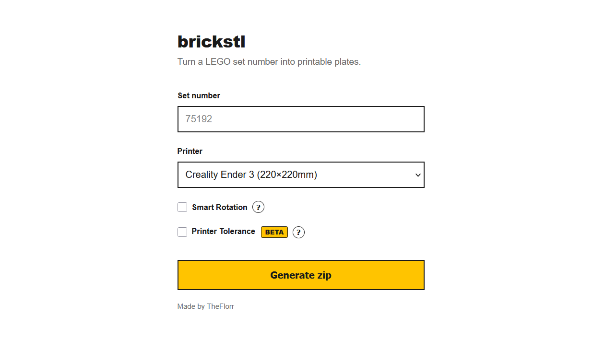

# brickstl

Turn a LEGO set number into 3D-printable plates.

`brickstl` takes a LEGO set number (e.g. `75192`), looks up every part in the set, converts each part's official LDraw geometry into 3D-printable meshes, packs them onto virtual print beds sized for your printer, and hands you back a zip file with ready-to-slice `.stl`/`.3mf` plates plus an Excel parts list with colors and quantities.

It ships as a small Flask web app with a single-page UI: enter a set number, pick your printer, click *Generate zip*.



---

## How it works

1. **Set lookup**: The set number is resolved against a bundled offline copy of the [Rebrickable](https://rebrickable.com/) parts database (SQLite), recursively expanding any sub-sets to build a flat list of `(part number, color, quantity)`.
2. **Geometry conversion**: Each part is resolved to its official [LDraw](https://www.ldraw.org/) `.dat` file (bundled locally in `parts/`), parsed, and recursively flattened into a triangle mesh, following any sub-part references and transforms.
3. **Mesh repair & tolerance**: Meshes are cleaned up, and if you enable **Printer Tolerance**, round connector features (studs, pins, axle ends, tubes, technic holes, clip barrels) are nudged by ±0.15 mm so printed parts click together instead of binding.
4. **Smart Rotation (optional)**: Each part is tested in a set of stable 90° orientations, and the orientation with the lowest estimated overhang/support risk and best plate contact is chosen automatically.
5. **Plate packing**: All parts (duplicated per quantity) are packed onto virtual print beds sized to your printer, respecting bed margins, and split into multiple plates as needed.
6. **Export**: Each plate is written out as both `.stl` and `.3mf`, alongside a `parts_list.xlsx` workbook listing every part, its quantity, color name/hex, and a suggested filament color. Everything is bundled into a single downloadable zip.

## Features

- 🔎 Convert any LEGO set number to printable geometry, including sets composed of sub-sets
- 🖨️ Built-in bed sizes for common printers (Ender 3/5, Prusa MK3/MK4, Bambu Lab A1/A1 Mini/X1C/P1S, Creality K1, Elegoo Neptune 4) or a custom bed size
- 🧩 **Smart Rotation**: automatically orients parts to minimize supports and overhangs
- 📐 **Printer Tolerance** *(beta)*: automatically adjusts connector geometry for a better FDM fit
- 🎨 Per-part color info and a generated Excel parts list with filament suggestions
- 📦 Output as both `.stl` and `.3mf`, packed across multiple plates automatically
- ⚡ Multi-threaded conversion for fast processing of large sets
- 🖥️ Simple, dependency-light web UI, no build step required

## Requirements

- Python 3.9+
- The project files, including the `database/` and `parts/` directories (already present if you cloned/downloaded the full repo; see [Project structure](#project-structure))

## Setup

Assuming you already have all the project files in your current directory:

1. **(Recommended) Create a virtual environment**

   ```bash
   python3 -m venv venv
   source venv/bin/activate   # Windows: venv\Scripts\activate
   ```

2. **Install dependencies**

   ```bash
   pip install -r requirements.txt
   ```

3. **Run the app**

   ```bash
   python app.py
   ```

4. **Open it in your browser**

   ```
   http://localhost:25570
   ```

That's it, no build step, no database setup. On first conversion, `brickstl` reassembles the split database chunks (`database/rebrickable.db.001` to `.003`) into a single SQLite file in your system temp directory and verifies its integrity via SHA-256, so subsequent runs are fast.

## Usage

1. Enter a LEGO **set number** (e.g. `75192`, or `75192-1`).
2. Choose your **printer** from the dropdown, or select **Custom bed size** and enter your bed's width/depth in mm.
3. Optionally enable:
   - **Smart Rotation**: orient each part for the best print result
   - **Printer Tolerance** *(beta)*: loosen/tighten connector features for a better fit
4. Click **Generate zip** and wait for conversion to finish. Progress is shown live.
5. Download the resulting zip. Inside you'll find:

   ```
   plate_1.stl
   plate_1.3mf
   plate_2.stl
   plate_2.3mf
   ...
   parts_list.xlsx
   ```

Load the `.stl` or `.3mf` plates into your slicer of choice and print. Parts that don't fit any configured bed size, or that couldn't be resolved to LDraw geometry, are reported at the end of the conversion (visible in the progress detail) rather than silently dropped.

## Project structure

```
brickstl/
├── app.py                 # Flask web server (routes, job queue, progress polling)
├── converter.py            # Core conversion pipeline: LDraw parsing, mesh ops,
│                            # tolerance/rotation logic, plate packing, STL/3MF/XLSX export
├── requirements.txt
├── database/
│   └── rebrickable.db.001  # Rebrickable parts database, split into chunks
│   └── rebrickable.db.002  # (reassembled and hash-verified at runtime)
│   └── rebrickable.db.003
├── parts/
│   ├── p/                  # LDraw primitive/part .dat files
│   └── parts/              # LDraw part .dat files
├── static/
│   ├── main.js              # Frontend form handling, progress polling
│   └── style.css
└── templates/
    └── index.html           # Single-page UI
```

## Configuration notes

- **Printer bed sizes** are defined in `converter.py` under `COMMON_PRINTERS`. Add an entry there (and a matching label in `app.py`'s `PRINTER_LABELS`) to make a new printer selectable in the dropdown.
- **Plate packing** limits (margin between parts, max parts per plate) are controlled by `BED_MARGIN` and `PLATE_LIMIT` in `converter.py`.
- **Tolerance amount** for the Printer Tolerance feature defaults to `0.15mm` (`DEFAULT_TOLERANCE_MM`).
- The server listens on port `25570` by default. Change this in the `app.run(...)` call at the bottom of `app.py` if needed.

## Limitations

- Only parts present in the bundled LDraw library can be converted; unsupported/missing parts are skipped and reported, not fabricated.
- Printer Tolerance uses heuristic geometry detection. It works well on standard bricks, plates, and Technic parts, but unusual or highly detailed geometry may be misjudged. Check your first print and disable it if a part doesn't fit right.
- This tool generates print-ready geometry only; it does not generate LEGO-official color matching for filaments beyond a name/hex suggestion.

## Credits

- Parts geometry: [LDraw.org](https://www.ldraw.org/)
- Set/parts data: [Rebrickable](https://rebrickable.com/)
